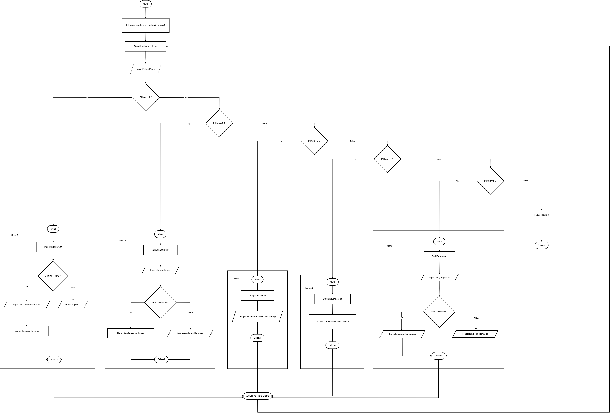

# 🚗 SIMULASI PARKIRAN CERDAS

Program manajemen parkir berbasis kapasitas dan waktu masuk menggunakan C++

## 📊 Status Progres: 75%

**Progres Saat Ini:**
- ✅ 4 Menu Selesai (Tambah, Keluar, Tampilkan, Exit)
- ⏳ 2 Menu Dalam Pengembangan (Bubble Sort, Sequential Search khusus)

## 📌 Fitur yang Sudah Selesai

✅ **Array 1 Dimensi** - Penyimpanan data plat nomor & waktu masuk
✅ **Menu Interaktif** - 6 pilihan menu yang mudah digunakan
✅ **Fungsi Modular** - 10 fungsi terpisah untuk kemudahan maintenance
✅ **Sequential Search** - Digunakan dalam fitur keluarkan kendaraan
✅ **Shift-Left Algorithm** - Penghapusan data dari array
✅ **Edge Case Handling** - Validasi parkiran penuh, kosong, dan data tidak ditemukan

## ⏳ Fitur Dalam Pengembangan

🔧 **Bubble Sort** - Pengurutan berdasarkan waktu masuk (target: minggu depan)  
🔧 **Sequential Search Menu Terpisah** - Pencarian khusus (target: minggu depan)  

## 🎯 Ketentuan PBL

Program ini dibuat sesuai proposal PBL dengan ketentuan:
- ✅ Menggunakan array 1 dimensi
- ✅ Menu interaktif (6 pilihan)
- ✅ Minimal 4 fungsi/prosedur (sudah ada 10 fungsi)
- ✅ Shift-left untuk penghapusan data
- ✅ Validasi edge case lengkap
- ⏳ Implementasi Bubble Sort (dalam pengembangan)
- ⏳ Implementasi Sequential Search terpisah (dalam pengembangan)
- ✅ Sequential Search sudah diterapkan di menu Keluarkan Kendaraan

## 📦 Struktur Data

```cpp
const int MAX_KAPASITAS = 5;           
string platNomor[MAX_KAPASITAS];       
string waktuMasuk[MAX_KAPASITAS];      
int jumlahKendaraan = 0;               
```

## 🔧 Fungsi-Fungsi Utama

| No | Fungsi | Status | Deskripsi |
|----|--------|--------|-----------|
| 1 | `tambahKendaraan()` | ✅ Selesai | Menambah kendaraan baru ke parkiran |
| 2 | `keluarkanKendaraan()` | ✅ Selesai | Mengeluarkan kendaraan dengan Sequential Search + Shift-Left |
| 3 | `tampilkanStatus()` | ✅ Selesai | Menampilkan semua data dalam tabel |
| 4 | `urutkanKendaraan()` | ⏳ Dalam Pengembangan | Bubble Sort berdasarkan waktu masuk |
| 5 | `cariKendaraan()` | ⏳ Dalam Pengembangan | Sequential Search menu terpisah |
| 6 | `tampilkanMenu()` | ✅ Selesai | Menampilkan menu utama |
| 7 | `clearScreen()` | ✅ Selesai | Membersihkan layar console |
| 8 | `tampilkanHeader()` | ✅ Selesai | Menampilkan header program |
| 9 | `pause()` | ✅ Selesai | Jeda untuk membaca output |
| 10 | `main()` | ✅ Selesai | Fungsi utama program |

## 🚀 Cara Kompilasi & Menjalankan

### **Windows (MinGW/g++)**
```bash
g++ -std=c++17 simulasi_parkiran_cerdas.cpp -o parkir.exe
parkir.exe
```

### **Linux/Mac**
```bash
g++ -std=c++17 simulasi_parkiran_cerdas.cpp -o parkir
./parkir
```

### **VS Code (dengan task)**
```bash
Tekan Ctrl+Shift+B → pilih "build and run"
```

## 📖 Menu Program

```
1. Masukkan Kendaraan              ✅ Berfungsi penuh
2. Keluarkan Kendaraan             ✅ Berfungsi penuh (dengan Sequential Search)
3. Tampilkan Status Parkir         ✅ Berfungsi penuh
4. Urutkan Kendaraan (Bubble Sort) ⏳ Dalam pengembangan
5. Cari Kendaraan (Sequential Search) ⏳ Dalam pengembangan
6. Keluar Program                  ✅ Berfungsi penuh
```

## 💡 Contoh Penggunaan

### **1. Tambah Kendaraan**
```
Plat Nomor   : B1234AB
Waktu Masuk  : 08:00

✓ Kendaraan berhasil masuk parkiran!
Total kendaraan saat ini: 1/5
```

### **2. Tampilkan Status**
```
--------------------------------------------------
No   Plat Nomor          Waktu Masuk         
--------------------------------------------------
1    B1234AB             08:00               
2    D5678CD             07:30               
3    E9012EF             09:00               
--------------------------------------------------
```

### **3. Keluarkan Kendaraan (dengan Sequential Search)**
```
Masukkan plat nomor yang akan keluar: B1234AB

✓ Kendaraan berhasil keluar!
Plat Nomor   : B1234AB
Waktu Masuk  : 08:00
Total kendaraan saat ini: 1/5
```

### **4. Urutkan (Bubble Sort) - Dalam Pengembangan**
```
INFORMASI: Fitur pengurutan sedang dalam tahap pengembangan.
```

### **5. Cari Kendaraan (Sequential Search) - Dalam Pengembangan**
```
INFORMASI: Fitur pencarian sedang dalam tahap pengembangan.

NOTE: Saat ini fitur pencarian otomatis sudah tersedia
      pada menu 'Keluarkan Kendaraan' (menu 2).
```

## ⚠️ Edge Cases yang Ditangani

| Situasi | Respons Program | Status |
|---------|----------------|---------|
| Parkiran penuh (5 kendaraan) | ❌ ERROR: Parkiran penuh! | ✅ Berfungsi |
| Parkiran kosong saat tampil | ℹ️ INFO: Parkiran kosong. | ✅ Berfungsi |
| Parkiran kosong saat keluar kendaraan | ❌ ERROR: Tidak ada kendaraan yang dapat dikeluarkan | ✅ Berfungsi |
| Kendaraan tidak ditemukan (menu 2) | ❌ ERROR: Kendaraan tidak ditemukan! | ✅ Berfungsi |
| Input menu tidak valid | ❌ ERROR: Pilihan tidak valid! | ✅ Berfungsi |
| Menu 4 & 5 (belum selesai) | ℹ️ Fitur sedang dalam tahap pengembangan | ⏳ Placeholder |

## 📊 Algoritma yang Sudah Diimplementasi

### **Sequential Search** ✅
- **Kompleksitas:** O(n)
- **Digunakan di:** Menu Keluarkan Kendaraan (menu 2)
- **Cara Kerja:** Memeriksa satu per satu elemen array dari index 0 hingga jumlahKendaraan-1
- **Fungsi:** Mencari kendaraan berdasarkan plat nomor sebelum dihapus

### **Shift-Left Algorithm** ✅
- **Kompleksitas:** O(n)
- **Digunakan di:** Menu Keluarkan Kendaraan (menu 2)
- **Cara Kerja:** Menggeser semua elemen setelah index yang dihapus ke kiri satu posisi
- **Fungsi:** Menghapus data dari array tanpa meninggalkan gap/lubang

## 🔧 Algoritma Dalam Pengembangan

### **Bubble Sort** ⏳
- **Status:** Sedang dipelajari dan akan diimplementasikan minggu depan
- **Target:** Mengurutkan kendaraan berdasarkan waktu masuk (ascending)
- **Kompleksitas:** O(n²)

### **Sequential Search (Menu Terpisah)** ⏳
- **Status:** Akan diadaptasi dari implementasi di menu 2
- **Target:** Menu pencarian khusus tanpa menghapus data
- **Kompleksitas:** O(n)

## 📊 Flowchart Program



*Flowchart menunjukkan alur kerja sistem parkir dari menu utama hingga setiap fitur yang tersedia.*

## 📁 File dalam Project

```
Based-Project/
├── flowchart/
│   └── Flowchart-Sistem-Parkir-Cerdas.drawio.png
├── simulasi_parkiran_cerdas.cpp    # File program utama (75% selesai)
├── simulasi_parkiran_cerdas.exe    # File executable hasil compile
└── README.md                        # File ini (overview project)
```

## 🎯 Rencana Penyelesaian

**Minggu Depan (Target 90-100%):**
1. ✅ Implementasi Bubble Sort di menu 4
2. ✅ Implementasi Sequential Search terpisah di menu 5
3. ✅ Testing menyeluruh untuk semua menu
4. ✅ Finalisasi dokumentasi

**Kendala yang Dihadapi:**
- Fokus pada fitur inti terlebih dahulu (CRUD + validasi)
- Memastikan edge case handling sempurna sebelum lanjut ke sorting/searching
- Mempelajari nested loop untuk Bubble Sort

## 👨‍💻 Informasi Developer

- **Proyek:** PBL - Simulasi Parkiran Cerdas
- **Bahasa:** C++
- **Standard:** C++17
- **IDE:** VS Code / Code::Blocks / Dev-C++

## 📄 Lisensi

Program ini dibuat untuk keperluan pembelajaran PBL (Project Based Learning).

---
